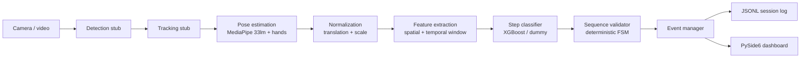

# BAS Experiment Assistant

AI-based **autonomous experiment execution and validation assistant for human spaceflight** (SIH 2026 ISRO problem statement: *"AI Human Activity Recognition for On-board BAS Experiments"*).

An offline, camera-based AI assistant observes an astronaut performing a predefined experiment, recognizes which **Experiment Step** is happening, validates it against the expected sequence, and guides/records the outcome: **Observe → Understand → Predict → Validate → Guide → Record**.

This is **protocol-aware** activity recognition, not generic HAR: the system asks *"What experiment step is being performed, is it valid at this point, and what should happen next?"*

**Project status:** PoC scaffold **implemented and tested** (98 tests, ruff/black clean, `run_pipeline.py` end-to-end). Next bottleneck: record the toy-protocol dataset and train the step classifier. Full status in `AGENTS.md` → Status; acceptance-criteria status in `docs/success-criteria.md`.

## Architecture



Each stage sits behind a Python `Protocol` (`src/bas_assistant/protocols.py`) so every component is replaceable. Design principle: **pretrained-and-frozen where the problem is solved (pose/hands), fine-tune small where it is task-specific (step classifier), hand-write logic where it is deterministic (FSM).** See `docs/architecture.md`.

## Implemented

- Modular pipeline: frame → detection → tracking → pose → normalization → features → step classification → FSM validation → event/JSONL record (`src/bas_assistant/pipeline/`).
- MediaPipe Pose (33 landmarks) + Hands estimators, with a deterministic `DummyPoseEstimator` fallback (`src/bas_assistant/pose/`).
- Translation/scale pose normalization (`src/bas_assistant/pose/normalization.py`).
- Spatial + temporal window feature extraction (fixed 34-dim vector) (`src/bas_assistant/features/`).
- `DummyClassifier` and an `XGBoostStepClassifier` wrapper that gracefully falls back to `unknown` when no model is present (`src/bas_assistant/classification/`).
- Deterministic Experiment Protocol FSM producing `confirmed` / `skipped` / `repeated` / `out-of-sequence` / `protocol_complete` outcomes for the 7-step "Sample Analysis" toy protocol (`src/bas_assistant/validation/`).
- Thread-safe event manager (`src/bas_assistant/events/`).
- JSON-lines session log repository (`data/processed/<session_id>.jsonl`) (`src/bas_assistant/storage/`).
- Deterministic camera capture layer: explicit backend (V4L2/DirectShow/Media Foundation), pixel-format + resolution + FPS negotiation with **read-back verification** and fallback modes, per-frame capture timing, and diagnostics (`src/bas_assistant/video/source.py`).
- Reusable timing/metrics utilities (`Metrics`, `FPSMeter`, `LatencyMeter`) with optional per-stage debug instrumentation (`src/bas_assistant/utils/timing.py`).
- Typed Pydantic settings loaded from `configs/default.yaml` (`src/bas_assistant/config/`).
- PySide6 desktop dashboard: video, system status, activity, event log, START/PAUSE/STOP (`src/bas_assistant/ui/dashboard.py`).
- Entry points: `scripts/run_demo.py`, `scripts/run_pipeline.py`, `scripts/run_dashboard.py`, `scripts/benchmark.py`, `scripts/camera_diagnostic.py`.
- Unit + integration tests (no GPU, no camera required) and GitHub Actions CI.

## Not yet implemented

- **Trained step classifier.** No model is trained; the pipeline defaults to the dummy classifier (`classifier.model_type: dummy`). Training is the dataset bottleneck (see `docs/implementation-roadmap.md`).
- MediaPipe `.task` model files are not committed (gitignored); download them with `scripts/download_mediapipe_models.py` for real pose.
- YOLO object detection fine-tuning (detection is a full-frame stub; hand-object interaction signals come from MediaPipe hands).
- Orientation-agnostic 3D human mesh recovery (normalization is translation/scale only).
- Voice alerts (pyttsx3), IP/RTSP streaming, ONNX edge export, SQLite/SQLAlchemy backend.
- No accuracy / FPS / latency / dataset-size numbers are reported anywhere — nothing has been measured on real hardware yet (see `docs/success-criteria.md` reporting rules).

## Setup

```bash
# Python 3.11+; dependency management via uv (pip fallback works too)
uv sync                 # base + dev dependencies
uv sync --extra ml      # + XGBoost / scikit-learn / mediapipe (for real pose + training)
uv sync --extra ui      # + PySide6 (for the dashboard)
```

`pip install -e ".[ml,ui,dev]"` is an equivalent fallback.

## Set up on your own machine

Fork or clone the repo, then get a working dev or demo environment. Everything below is verified against a clean checkout (Python 3.11+, Linux).

### Prerequisites

- Python 3.11+ (`python3 --version`)
- `git`
- `uv` (one-time install, then restart your shell):

```bash
curl -LsSf https://astral.sh/uv/install.sh | sh
```

### 1. Clone (or fork, then clone your fork)

```bash
git clone <your-fork-or-repo-url>
cd <repo-dir>
```

### 2. Install dependencies

```bash
uv sync --all-extras       # everything: base + ml + ui + dev (recommended)
# or only what you need:
uv sync                    # base + dev
uv sync --extra ml         # + XGBoost / scikit-learn / mediapipe
uv sync --extra ui         # + PySide6 dashboard
```

No `uv`? Equivalent pip fallback:

```bash
python3 -m venv .venv && source .venv/bin/activate
pip install -e ".[all]"
```

### 3. Download MediaPipe model files (for real pose)

The MediaPipe pose + hand estimators use the current Tasks API, which reads `.task`
model bundles from `models/` (gitignored). Fetch them once:

```bash
uv run python scripts/download_mediapipe_models.py
```

Skip this if you only run with `--pose dummy`.

### 4. Verify the environment

```bash
uv run python -c "import bas_assistant; print('OK')"
uv run pytest                            # 98 tests, offline, CPU-only
uv run ruff check .
uv run black --check src scripts tests
```

### 5. Run a demo (no webcam required)

```bash
uv run python scripts/run_pipeline.py --source dummy --pose dummy --max-frames 300
uv run python scripts/run_demo.py --source dummy --pose dummy --max-frames 300
```

For a live webcam run, drop `--source dummy` (use `--source 0`). The PySide6 dashboard needs a real camera or a video file: `uv run python scripts/run_dashboard.py --source 0`.

### Troubleshooting

- **No webcam / camera permission denied** → use `--source dummy --pose dummy`. The pipeline and interactive demo run fully offline; only the dashboard requires a camera or video file.
- **Hand/pose detection is poor or flickering on Linux (works on Windows)** → the webcam may be falling back to uncompressed YUYV at ~10 fps, which starves MediaPipe's temporal hand tracking. Confirm with `v4l2-ctl -d /dev/video0 --get-fmt-video`. Set `camera.format: MJPG` in `configs/default.yaml` (the default) so OpenCV negotiates MJPEG at 30 fps; the app logs the negotiated backend/codec/fps on startup. Run `python scripts/camera_diagnostic.py` to verify the camera itself delivers the requested mode before MediaPipe is involved. Hand inference also runs on a worker thread in the MediaPipe estimator so the expensive palm-detection graph never throttles the main pose loop. If markers still flicker on a weak/low-light camera, lower `pose.min_hand_detection_confidence` and/or raise `pose.hand_hold_seconds` in `configs/default.yaml`.
- **`uv sync` errors** → delete `uv.lock` and re-run `uv sync --all-extras`.
- **MediaPipe import errors** → make sure you are inside the project venv (use `uv run`, not a system Python).

## Camera configuration & diagnostics

The camera capture layer is the only place that talks to OpenCV/V4L2/DirectShow. It
requests an explicit mode, then **reads the negotiated values back** — camera drivers
(especially V4L2) may silently pick a different mode than the one requested, so the
app never trusts that `cap.set()` succeeded.

### Supported configuration (`configs/default.yaml`)

```yaml
camera:
  device: 0            # camera index (int) or path to a video file
  width: 1280
  height: 720
  fps: 30
  format: MJPG         # FourCC (MJPG, YUYV, ...) or None for driver default
  backend: auto        # auto | v4l2 | dshow | msmf
  disable_dynamic_framerate: false   # Linux/V4L2 only, needs v4l2-ctl
```

`backend: auto` resolves to **V4L2 on Linux** and **DirectShow on Windows**, both of
which honour explicit property requests reliably (OpenCV's `CAP_ANY` can pick a
backend where `set()` silently does nothing). Video files always use the FFMPEG path
and ignore `format`/`backend`/`fps`.

On startup the app logs the resolved backend and the requested vs actual mode, e.g.:

```
Camera backend=V4L2 requested=1280x720 @ 30 FPS MJPG actual=1280x720 @ 30 FPS MJPG
```

If the requested mode is unavailable it falls back through a small list of supported
modes (`960x540`, `640x480`, then YUYV variants) and logs a warning.

### Recommended configurations

- **Linux** — `device: 0`, `width: 1280`, `height: 720`, `fps: 30`, `format: MJPG`,
  `backend: auto` (→ V4L2). If capture FPS is low, set
  `disable_dynamic_framerate: true` (see below).
- **Windows** — defaults are fine: `backend: auto` (→ DirectShow), `format: MJPG`.

### Linux frame-rate drops: `exposure_dynamic_framerate`

Measured on a typical integrated laptop camera (Arch/Omarchy 4):

| `exposure_dynamic_framerate` | measured capture FPS |
|---|---|
| `1` (driver default) | **~17 fps** |
| `0` (disabled) | **~30 fps** |

The UVC driver enables this control by default; combined with aperture-priority
auto-exposure it stretches exposure and silently drops delivered frames to ~17 fps —
well below the negotiated 30 fps — which starves MediaPipe's temporal hand tracking
("flickering / fails to detect both hands"). The negotiated mode still *reports*
30 fps, so only per-frame measurement reveals it. Set
`camera.disable_dynamic_framerate: true` (requires `v4l2-ctl`; ignored on Windows)
or run `v4l2-ctl -d /dev/video0 --set-ctrl exposure_dynamic_framerate=0` manually.

### Run the camera diagnostic (no MediaPipe)

```bash
uv run python scripts/camera_diagnostic.py                      # default config
uv run python scripts/camera_diagnostic.py --no-display --frames 200
uv run python scripts/camera_diagnostic.py --disable-dynamic-framerate
uv run python scripts/camera_diagnostic.py --save-dir /tmp/cam --no-display
```

It opens the same `OpenCVVideoSource` the app uses, prints the negotiated
backend/requested/actual mode, measures effective capture FPS and read failures, and
optionally shows the feed / saves sample frames. Expected output:

```
Camera backend: V4L2
Requested: 1280x720 @ 30 FPS MJPG
Actual:    1280x720 @ 30 FPS MJPG
Frames: 120 read, 0 failed (over 4.4 s)
Capture FPS (measured): 30.4
Mean capture time: 32.9 ms
Mean frame gap: 32.9 ms
```

If measured capture FPS is well below the requested FPS while the negotiated mode
still reports full FPS, the driver is throttling delivery (see the
`exposure_dynamic_framerate` note above) — the script prints a hint for this case.

### Debug timing instrumentation

Per-frame vision timing (camera capture, pose, hands, total) is opt-in and off by
default:

```bash
uv run python scripts/run_demo.py --metrics
uv run python scripts/run_pipeline.py --source 0 --metrics
# or in configs/default.yaml:  pipeline: { metrics_enabled: true }
```

At session end it logs mean/last durations per stage (pose inference, total vision
processing, inferred FPS) plus processed-frame counts. Camera-side diagnostics
(backend, requested/actual mode, frames read/failed, capture ms, frame gap) are
logged periodically every 300 frames and on `stop()`.

### AI-agent one-shot setup prompt

Paste this into your AI agent (opencode, Copilot, Claude Code, ...) to set up the environment hands-free:

```text
Set up this repo for local development/demo following README.md "Set up on
your own machine", AGENTS.md, and pyproject.toml:
1. Ensure Python 3.11+ is available.
2. Install `uv` if missing (curl -LsSf https://astral.sh/uv/install.sh | sh).
3. Run `uv sync --all-extras` (pip fallback: `pip install -e ".[all]"`).
4. Verify that `uv run pytest`, `uv run ruff check .`, and
   `uv run black --check src scripts tests` all pass.
5. Smoke-run `uv run python scripts/run_pipeline.py --source dummy --pose
   dummy --max-frames 50` and confirm it writes a JSONL session log.
Do not report success unless the tests pass and the pipeline writes a
session log. Report installed package versions and any errors verbatim.
```

## Running

```bash
# Headless end-to-end run -> writes a JSONL session log to data/processed/
python scripts/run_pipeline.py --source dummy --pose dummy --max-frames 300

# Interactive demo (webcam or video file; 'q' / ESC to quit)
python scripts/run_demo.py                        # webcam
python scripts/run_demo.py --source path/to/video.mp4
python scripts/run_demo.py --source dummy --pose dummy --max-frames 300

# PySide6 dashboard (requires the 'ui' extra: `uv sync --extra ui`)
python scripts/run_dashboard.py --source 0

# Micro-benchmark (measured latency/FPS on synthetic input)
python scripts/benchmark.py --max-frames 500

# Camera diagnostic (verify the negotiated capture mode before MediaPipe)
python scripts/camera_diagnostic.py            # camera + live window
python scripts/camera_diagnostic.py --no-display --frames 200 --save-dir /tmp/cam
```

Configure via `configs/default.yaml` (overridable with `BAS_`-prefixed env vars, e.g. `BAS_CLASSIFIER__MODEL_TYPE=xgboost`).

## Camera configuration & diagnostics

The capture layer (`src/bas_assistant/video/source.py`) owns all platform-specific
handling — the rest of the pipeline only ever sees plain NumPy/OpenCV frames.

```yaml
camera:
  device: 0            # camera index (int) or path to a video file
  width: 1280
  height: 720
  fps: 30
  format: MJPG         # pixel format / FourCC; None = driver default
  backend: auto        # auto | v4l2 | dshow | msmf
```

- **`format`** is requested **before** FPS/resolution. `MJPG` avoids the Linux
  V4L2 fallback to uncompressed YUYV, which often caps high resolutions at ~10 fps
  and degrades MediaPipe hand tracking.
- **`backend: auto`** resolves to **V4L2 on Linux** and **DirectShow on Windows**
  (Media Foundation can be forced with `msmf`). Video files always use OpenCV's
  default (FFMPEG) backend regardless of this setting.
- **Drivers silently renegotiate.** Camera drivers frequently ignore `set()`
  requests and pick a nearby supported mode, so the app never assumes `cap.set()`
  succeeded: after opening, it reads the actual width/height/FPS/pixel format back,
  logs them, falls back through `DEFAULT_FALLBACK_MODES` when the requested mode is
  unavailable, and warns when the negotiated mode differs from what was asked.

### Recommended configuration

| Platform | Recommended |
|---|---|
| **Linux (V4L2)** | `1280x720 @ 30 fps MJPG`, `backend: v4l2` (or `auto`) |
| **Windows (DirectShow)** | `1280x720 @ 30 fps MJPG`, `backend: auto` (falls back to DirectShow) |

### Verify the camera with `scripts/camera_diagnostic.py`

Runs the camera through the same `OpenCVVideoSource` the application uses — before
MediaPipe is involved — so you can tell a camera problem from a vision problem:

```bash
python scripts/camera_diagnostic.py                        # default config
python scripts/camera_diagnostic.py --device 1 --no-display --frames 200
python scripts/camera_diagnostic.py --no-display --save-dir /tmp/cam   # save sample frames
python scripts/camera_diagnostic.py --width 640 --height 480 --format YUYV
```

Example output:

```
Camera backend: V4L2
Requested: 1280x720 @ 30 FPS MJPG
Actual:    1280x720 @ 30 FPS MJPG
Frames: 300 read, 0 failed (over 10.1 s)
Capture FPS (measured): 29.8
Mean capture time: 4.2 ms
Mean frame gap: 33.5 ms
Frame size: 1280x720
```

Interpretation:

- `Actual:` matching `Requested:` → the driver accepted the mode; a mismatch means
  the app fell back (expect a `WARNING` log from the app too).
- `Capture FPS (measured)` near the requested FPS → the camera stream itself is
  healthy; the next thing to check is the vision pipeline.
- `Capture FPS` far below the requested FPS, or many `Frame drops` → the camera /
  driver is the bottleneck (e.g. YUYV at high resolution), not MediaPipe.

### Debug timing (`pipeline.metrics_enabled`)

Per-stage instrumentation is **off by default**. Enable it in
`configs/default.yaml` (`pipeline.metrics_enabled: true`) or per-run with
`--metrics` on `run_pipeline.py` / `run_demo.py`. It measures, per frame:
camera capture time and inter-frame gaps (logged periodically by the source),
Pose inference, Hands inference (worker thread), total vision-processing time,
frames processed, and effective FPS. A summary is printed when the run ends
(`python scripts/run_pipeline.py --source 0 --metrics`). `scripts/benchmark.py`
reports measured (never invented) throughput and latency on synthetic input.

### Capture loop and MediaPipe

The demo (`run_demo.py`) and dashboard worker loop run serially:
`capture → pose → (hands on a worker thread) → features → classify → UI`.
**Pose inference therefore blocks the next camera read** in that loop; Hands
already run on a dedicated worker thread so their cost no longer throttles the
pose/frame loop. If capture FPS is healthy (see the diagnostic above) but the
vision pipeline is slower than the camera, the effective frame rate will be set
by inference, not by the camera. Instrument first (`--metrics`), then consider
decoupling capture from inference with a bounded frame queue only if the numbers
show pose latency is starving capture.

## Toy protocol (demo source of truth)

"Sample Analysis" — 7 steps: S0 Start · S1 Open sample tray · S2 Pick sample · S3 Place sample under scope · S4 Adjust focus knob · S5 Record reading · S6 Close tray · S7 Complete.

The FSM knows the expected next step and flags `confirmed` / `skipped` / `repeated` / `out-of-sequence`. The graded **skip-Step-3** scenario is covered by tests (`tests/integration/test_vertical_slice.py`).

## Testing & quality

```bash
pytest                 # 98 tests, offline, CPU-only (includes the no-camera integration test)
ruff check .
black --check src scripts tests
```

CI (`.github/workflows/ci.yml`): install deps → Ruff → pytest.

## Development

- Read `AGENTS.md`, `CONTEXT.md` (glossary), and `docs/adr/` first; `docs/` has architecture, roadmap, standards, and success criteria.
- Use the canonical domain vocabulary from `CONTEXT.md`.
- Reporting integrity is non-negotiable: distinguish `Implemented / Tested / Planned / Proposed / Target / Assumption`; never invent accuracy or performance numbers.

## License

MIT — see `LICENSE`.