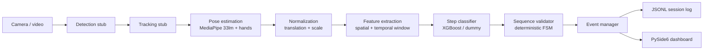

# BAS Experiment Assistant

AI-based **autonomous experiment execution and validation assistant for human spaceflight** (SIH 2026 ISRO problem statement: *"AI Human Activity Recognition for On-board BAS Experiments"*).

An offline, camera-based AI assistant observes an astronaut performing a predefined experiment, recognizes which **Experiment Step** is happening, validates it against the expected sequence, and guides/records the outcome: **Observe → Understand → Predict → Validate → Guide → Record**.

This is **protocol-aware** activity recognition, not generic HAR: the system asks *"What experiment step is being performed, is it valid at this point, and what should happen next?"*

**Project status:** PoC scaffold **implemented and tested** (49 tests, ruff/black clean, `run_pipeline.py` end-to-end). Next bottleneck: record the toy-protocol dataset and train the step classifier. Full status in `AGENTS.md` → Status; acceptance-criteria status in `docs/success-criteria.md`.

## Architecture



Each stage sits behind a Python `Protocol` (`src/bas_assistant/protocols.py`) so every component is replaceable. Design principle: **pretrained-and-frozen where the problem is solved (pose/hands), fine-tune small where it is task-specific (step classifier), hand-write logic where it is deterministic (FSM).** See `docs/architecture.md`.

## Implemented

- Modular pipeline: frame → detection → tracking → pose → normalization → features → step classification → FSM validation → event/JSONL record (`src/bas_assistant/pipeline/`).
- MediaPipe Pose (33 landmarks) + Hands estimators, with a deterministic `DummyPoseEstimator` fallback (`src/bas_assistant/pose/`).
- Translation/scale pose normalization (`src/bas_assistant/pose/normalization.py`).
- Spatial + temporal window feature extraction (fixed 34-dim vector) (`src/bas_assistant/features/`).
- `DummyClassifier` and an `XGBoostStepClassifier` wrapper that gracefully falls back to `unknown` when no model is present (`src/bas_assistant/classification/`).
- Deterministic Experiment Protocol FSM producing `confirmed` / `skipped` / `repeated` / `out-of-sequence` / `protocol_complete` outcomes for the 7-step "Sample Analysis" toy protocol (`src/bas_assistant/validation/`).
- Thread-safe event manager (`src/bas_assistant/events/`).
- JSON-lines session log repository (`data/processed/<session_id>.jsonl`) (`src/bas_assistant/storage/`).
- Typed Pydantic settings loaded from `configs/default.yaml` (`src/bas_assistant/config/`).
- PySide6 desktop dashboard: video, system status, activity, event log, START/PAUSE/STOP (`src/bas_assistant/ui/dashboard.py`).
- Entry points: `scripts/run_demo.py`, `scripts/run_pipeline.py`, `scripts/run_dashboard.py`, `scripts/benchmark.py`.
- Unit + integration tests (no GPU, no camera required) and GitHub Actions CI.

## Not yet implemented

- **Trained step classifier.** No model is trained; the pipeline defaults to the dummy classifier (`classifier.model_type: dummy`). Training is the dataset bottleneck (see `docs/implementation-roadmap.md`).
- YOLO object detection fine-tuning (detection is a full-frame stub; hand-object interaction signals come from MediaPipe hands).
- Orientation-agnostic 3D human mesh recovery (normalization is translation/scale only).
- Voice alerts (pyttsx3), IP/RTSP streaming, ONNX edge export, SQLite/SQLAlchemy backend.
- No accuracy / FPS / latency / dataset-size numbers are reported anywhere — nothing has been measured on real hardware yet (see `docs/success-criteria.md` reporting rules).

## Setup

```bash
# Python 3.11+; dependency management via uv (pip fallback works too)
uv sync                 # base + dev dependencies
uv sync --extra ml      # + XGBoost / scikit-learn / mediapipe (for real pose + training)
uv sync --extra ui      # + PySide6 (for the dashboard)
```

`pip install -e ".[ml,ui,dev]"` is an equivalent fallback.

## Set up on your own machine

Fork or clone the repo, then get a working dev or demo environment. Everything below is verified against a clean checkout (Python 3.11+, Linux).

### Prerequisites

- Python 3.11+ (`python3 --version`)
- `git`
- `uv` (one-time install, then restart your shell):

```bash
curl -LsSf https://astral.sh/uv/install.sh | sh
```

### 1. Clone (or fork, then clone your fork)

```bash
git clone <your-fork-or-repo-url>
cd <repo-dir>
```

### 2. Install dependencies

```bash
uv sync --all-extras       # everything: base + ml + ui + dev (recommended)
# or only what you need:
uv sync                    # base + dev
uv sync --extra ml         # + XGBoost / scikit-learn / mediapipe
uv sync --extra ui         # + PySide6 dashboard
```

No `uv`? Equivalent pip fallback:

```bash
python3 -m venv .venv && source .venv/bin/activate
pip install -e ".[all]"
```

### 3. Verify the environment

```bash
uv run python -c "import bas_assistant; print('OK')"
uv run pytest                            # 49 tests, offline, CPU-only
uv run ruff check .
uv run black --check src scripts tests
```

### 4. Run a demo (no webcam required)

```bash
uv run python scripts/run_pipeline.py --source dummy --pose dummy --max-frames 300
uv run python scripts/run_demo.py --source dummy --pose dummy --max-frames 300
```

For a live webcam run, drop `--source dummy` (use `--source 0`). The PySide6 dashboard needs a real camera or a video file: `uv run python scripts/run_dashboard.py --source 0`.

### Troubleshooting

- **No webcam / camera permission denied** → use `--source dummy --pose dummy`. The pipeline and interactive demo run fully offline; only the dashboard requires a camera or video file.
- **`uv sync` errors** → delete `uv.lock` and re-run `uv sync --all-extras`.
- **MediaPipe import errors** → make sure you are inside the project venv (use `uv run`, not a system Python).

### AI-agent one-shot setup prompt

Paste this into your AI agent (opencode, Copilot, Claude Code, ...) to set up the environment hands-free:

```text
Set up this repo for local development/demo following README.md "Set up on
your own machine", AGENTS.md, and pyproject.toml:
1. Ensure Python 3.11+ is available.
2. Install `uv` if missing (curl -LsSf https://astral.sh/uv/install.sh | sh).
3. Run `uv sync --all-extras` (pip fallback: `pip install -e ".[all]"`).
4. Verify that `uv run pytest`, `uv run ruff check .`, and
   `uv run black --check src scripts tests` all pass.
5. Smoke-run `uv run python scripts/run_pipeline.py --source dummy --pose
   dummy --max-frames 50` and confirm it writes a JSONL session log.
Do not report success unless the tests pass and the pipeline writes a
session log. Report installed package versions and any errors verbatim.
```

## Running

```bash
# Headless end-to-end run -> writes a JSONL session log to data/processed/
python scripts/run_pipeline.py --source dummy --pose dummy --max-frames 300

# Interactive demo (webcam or video file; 'q' / ESC to quit)
python scripts/run_demo.py                        # webcam
python scripts/run_demo.py --source path/to/video.mp4
python scripts/run_demo.py --source dummy --pose dummy --max-frames 300

# PySide6 dashboard (requires the 'ui' extra: `uv sync --extra ui`)
python scripts/run_dashboard.py --source 0

# Micro-benchmark (measured latency/FPS on synthetic input)
python scripts/benchmark.py --max-frames 500
```

Configure via `configs/default.yaml` (overridable with `BAS_`-prefixed env vars, e.g. `BAS_CLASSIFIER__MODEL_TYPE=xgboost`).

## Toy protocol (demo source of truth)

"Sample Analysis" — 7 steps: S0 Start · S1 Open sample tray · S2 Pick sample · S3 Place sample under scope · S4 Adjust focus knob · S5 Record reading · S6 Close tray · S7 Complete.

The FSM knows the expected next step and flags `confirmed` / `skipped` / `repeated` / `out-of-sequence`. The graded **skip-Step-3** scenario is covered by tests (`tests/integration/test_vertical_slice.py`).

## Testing & quality

```bash
pytest                 # 49 tests, offline, CPU-only (includes the no-camera integration test)
ruff check .
black --check src scripts tests
```

CI (`.github/workflows/ci.yml`): install deps → Ruff → pytest.

## Development

- Read `AGENTS.md`, `CONTEXT.md` (glossary), and `docs/adr/` first; `docs/` has architecture, roadmap, standards, and success criteria.
- Use the canonical domain vocabulary from `CONTEXT.md`.
- Reporting integrity is non-negotiable: distinguish `Implemented / Tested / Planned / Proposed / Target / Assumption`; never invent accuracy or performance numbers.

## License

MIT — see `LICENSE`.